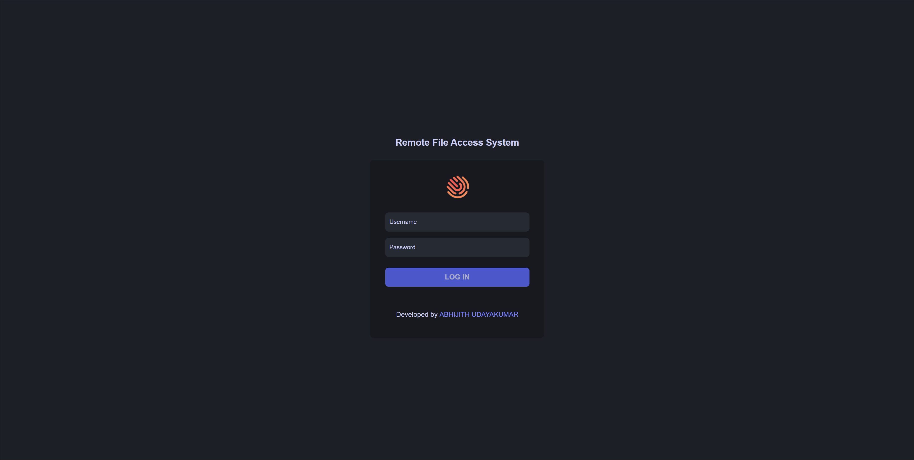

<p align="center">

</p>
<h1 align="center">
 Project-FTPServer
</h1>

<p align="center">
  Be sure to ⭐ this repo so you can keep up to date on any daily progress!
</p>

<p align="center">
<a href="https://github.com/Abhijith14/PROJECT-CONNECT-v1/" target="_blank">
    
</a>&nbsp;
<a href="https://www.python.org/" target="_blank">
    
</a>&nbsp;
<a href="https://github.com/Abhijith14/PROJECT-CONNECT-v1" target="_blank">
    
</a>&nbsp;

</p>

<br>


## ⚡️ Quick start

<br>


> 🔔 Please note: You may use this tool to remotely access your computer files through any web browser on the Internet. You will need to enter your username and password to access your files. Please note that there is no encryption invloved in the password protection mechanism or  whatesoever. Hence, it is not secure cryptographically.

<br>

First of all, download and install [Python](https://www.python.org/downloads/) and your favourite IDE (I used [PyCharm](https://www.jetbrains.com/pycharm/download/#section=windows)). Python Version `3.6` or higher is required. 

Next, download ngrok from [Ngrok](https://ngrok.com/) and create an account. (We use this to create a secure tunnel to the localhost). 

<br>


### 🔧 Configure

<br>

- Open [main.py](main.py) and change <b>USERNAME</b><i>(ln 11)</i> and <b>PASSWORD</b><i>(ln 12)</i> value to your required values.
- Change <b>PATH</b><i>(ln 14)</i> value to the directory on your computer which you want to make accessible by the server.
- Start command prompt at the location where you downloaded ngrok and run the command:

```bash
ngrok tcp 1560
```

- This will open a ngrok prompt where you can see the status of your tunnel, wait until it says 'online'.

<br>


### 💻 Run Project

<br>

Run [main.py](main.py).

```bash
python main.py
```

<B>Now, the Server is Up and Running...<B>

<br>
<br>

## ⭐️ Project assistance

If you want to say **thank you** or/and support active development of `Project-FTPServer`:

- Add a [GitHub Star](https://github.com/Abhijith14/Project-FTPServer) to the project.
- Write interesting articles about project on [Dev.to](https://dev.to/), [Medium](https://medium.com/) or personal blog.

Together, we can make this project **better** every day! 😘

<br>

### 🛠️ Built With

- [Python 3.8](https://www.python.org/) - Creating Project

### ❤️ Authors

- **Abhijith Udayakumar** - *Design & Development* - [Abhijith14](https://github.com/Abhijith14)

<br>
<br>

## 🚨 Forking this repo (please read!)

_**yes, with attribution**_.

I value keeping my work open source, but as you all know, _**plagiarism is bad**_. It's always disheartening whenever I find that someone has copied my work without giving me credit. I spent a non-trivial amount of effort building and designing this project, and I am proud of it! All I ask of you all is to not claim this effort as your own.

### TL;DR

Yes, you can fork this repo. Please give me proper credit by linking back to [Abhijith14/Project-FTPServer](https://github.com/Abhijith14/Project-FTPServer). Thanks!
